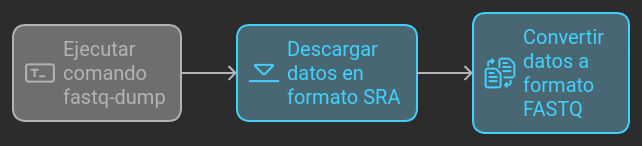

# Accediendo al Archivo de secuencia de Lecturas (SRA)

## 1. ¿Qué es el Archivo de Secuencia de Lecturas (SRA)?

El Archivo de Secuencia de Lecturas (SRA, por sus siglas en inglés) es un servicio de almacenamiento de datos proporcionado por NCBI. 

## 2. ¿Cuáles son los esquemas de nomenclatura del SRA?

Los datos en el SRA están organizados bajo una estructura jerárquica donde cada categoría superior puede contener una o más subcategorías:

- **NCBI BioProject**: PRJN**** (ejemplo: PRJNA257197) contiene la descripción general de una sola iniciativa de investigación; un proyecto generalmente estará relacionado con múltiples muestras y conjuntos de datos.
- **NCBI BioSample**: SAMN**** o SRS**** (ejemplo: SAMN03254300) describe material biológico fuente; cada espécimen físicamente único se registra como una única BioSample con un conjunto único de atributos.
- **SRA Experiment**: SRX****, una biblioteca de secuenciación única para una muestra específica.
- **SRA Run**: SRR**** o ERR**** (ejemplo: SRR1553610) es un manifiesto de archivo(s) de datos vinculado a una biblioteca de secuenciación dada (experimento).


  
## 3. ¿Cómo descargamos datos del SRA?

Puedes descargar datos a través de un navegador web (https://www.ncbi.nlm.nih.gov/sra) o desde la línea de comandos mediante el paquete sratoolkit (https://github.com/ncbi/sra-tools), que se puede instalar a través de conda.

```
conda install bioconda::sra-tools
```

## 4. ¿Existen alternativas al SRA?


## 5. ¿Dónde está la documentación del SRA?


## 6. ¿Cómo funciona el sratoolkit?

Existen varias herramientas y las más utilizadas son:

- **fastq-dump**, descarga datos en formato FASTQ.
- **sam-dump**, descarga datos en formato de alineación SAM.

Un caso de uso típico es `fastq-dump SRR1553607`, lo que crea el archivo: `SRR1553607.fastq`.

Por defecto, los datos del SRA concatenarán las lecturas pareadas. Para las lecturas pareadas, los datos deben separarse en diferentes archivos:

```bash
fastq-dump --split-files SRR1553607
```

Esto crea los archivos de lecturas pareadas:

```bash
SRR1553607_1.fastq
SRR1553607_2.fastq
```

El comando `fastq-dump` realiza dos cosas en secuencia. Primero descarga los datos en el formato SRA y luego los convierte al formato FASTQ. 



Podemos pedirle a la herramienta que convierta solo un subconjunto de datos; por ejemplo, las primeras 10,000 lecturas:

```bash
fastq-dump --split-files -X 10000 SRR1553607
```

Pero notamos que incluso en ese caso, `fastq-dump` necesita primero descargar el archivo de datos completo.

## 7. ¿Existe una forma más sencilla de consultar números de SRA?

Philip Ewels creó un servicio llamado [SRA Explorer](https://sra-explorer.info/) que proporciona una interfaz incomparablemente mejor que la de NCBI.

Dado que es un servicio proporcionado por un científico independiente, puede no estar continuamente actualizado o soportado.

## 8. ¿Dónde está el archivo SRA?

El comando `srapath` puede listar la ubicación del archivo, ya sea si ha sido descargado localmente o si aún está en la web:

```bash
srapath SRR1553607
```

Imprime:

```
https://sra-pub-run-odp.s3.amazonaws.com/sra/SRR1553607/SRR1553607
```

Pero después de ejecutar:

```bash
prefetch SRR1553607
```

El mismo comando `srapath SRR1553607` imprimirá:

```
/Users/ialbert/ncbi/public/sra/SRR1553607.sra
```

## 9. ¿A dónde van las descargas?

Cuando se inicia cualquier descarga a través de `fastq-dump`, los datos completos para ese ID de ejecución se descargarán a una ubicación en tu computadora. Puedes ver esa ruta con:

```bash
srapath SRR1553607
```

Por defecto, esta ubicación es en `~/ncbi/public/sra/`. Puede haber otras secuencias relacionadas con un archivo SRA, en cuyo caso también se descargarán.

Para investigar los datos SRA descargados, haz:

```bash
ls -l ~/ncbi/public/sra/
```

Después de completar la descarga, se realiza una conversión según los parámetros.

> **Nota**: Incluso si solo pedimos las primeras diez lecturas de un archivo FASTQ, el contenido completo del FASTQ deberá descargarse en la ubicación “oculta” y, a partir de eso, se mostrarán las primeras diez lecturas. Para conjuntos de datos grandes, esto puede tomar una cantidad considerable de tiempo y puede usar una cantidad sustancial de espacio en disco. Ahora, si accedemos al mismo ID de ejecución de SRA una segunda vez, los datos ya estarán allí y la conversión será mucho más rápida.

## 10. ¿Qué es un “spot” en SRA?

Las herramientas SRA usan la palabra “spots” y no “lecturas” (mediciones), aunque casi siempre parecen significar lo mismo. 

¿Qué es un “Spot” en el formato SRA?

“El modelo de spot es centrado en Illumina GA. […] Todas las bases para una única ubicación constituyen el spot.”

Resulta que la terminología es confusa y puede no aplicarse a otros instrumentos.

En los secuenciadores Illumina, una única ubicación en la celda de flujo genera la primera lectura, el código de barras (si existe), y la segunda lectura (pareada) (si la ejecución fue una secuenciación de extremos pareados). Casi siempre dividimos los spots (mediante la opción `--split-files`) en archivos de origen.

## 11. ¿Cómo obtenemos información sobre la ejecución?

El programa `sra-stat` puede generar un informe en XML sobre los datos.

### Obtener estadísticas de longitud de lectura en un conjunto de datos de PacBio:

```bash
sra-stat --xml --statistics SRR4237168
```
Produciendo:

```
<Run accession="SRR4237168" read_length="variable" spot_count="2452" base_count="7313936" base_count_bio="7313936" spot_count_mates="0" base_count_bio_mates="0" spot_count_bad="0" base_count_bio_bad="0" spot_count_filtered="0" base_count_bio_filtered="0">
  <Size value="5018039" units="bytes"/>
  <Bases cs_native="false" count="7313936">
    <Base value="A" count="1599468"/>
    <Base value="C" count="1965864"/>
    <Base value="G" count="2114395"/>
    <Base value="T" count="1634209"/>
    <Base value="N" count="0"/>
  </Bases>
  <AlignInfo>
  </AlignInfo>
  <Statistics nreads="1" nspots="2452">
    <Read index="0" count="2452" average="2982.85" stdev="3115.22"/>
  </Statistics>
  <QualityCount>
    <Quality value="0" count="3598"/>
    <Quality value="1" count="62887"/>
    <Quality value="2" count="168752"/>
    <Quality value="3" count="157487"/>
    <Quality value="4" count="171074"/>
    <Quality value="5" count="233885"/>
    <Quality value="6" count="274003"/>
    <Quality value="7" count="329025"/>
    <Quality value="8" count="414111"/>
    <Quality value="9" count="470791"/>
    <Quality value="10" count="499845"/>
    <Quality value="11" count="623351"/>
    <Quality value="12" count="814500"/>
    <Quality value="13" count="1550204"/>
    <Quality value="14" count="1540406"/>
    <Quality value="15" count="17"/>
  </QualityCount>
  <Databases>
    <Database>
      <Table name="SEQUENCE">
        <Statistics source="meta">
          <Rows count="2452"/>
          <Elements count="7313936"/>
        </Statistics>
      </Table>
    </Database>
  </Databases>
</Run>
```

---

# Automatizando el acceso al SRA

Demostramos cómo automatizar el acceso al Short Read Archive (SRA) para obtener datos depositados con publicaciones científicas. Mostramos cómo obtener información sobre todos los datos almacenados en SRA y compilar varias estadísticas sobre ellos. 

## 1. ¿Cómo automatizar la descarga de múltiples ejecuciones de SRA?

La estrategia principal es obtener primero el número del proyecto PRJN, luego, a partir de los números del proyecto, obtener los números de ejecución SRR, y finalmente ejecutar `fastq-dump` en cada número SRR. 

Comenzaremos con el número del bioproyecto que se encuentra en la publicación. Por ejemplo, en *Genomic surveillance elucidates Ebola virus origin*, notamos que el número del proyecto es PRJNA257197.

```bash
esearch -db sra -query PRJNA257197
```

El comando anterior devuelve un “resultado de búsqueda” que nos indica que hay 891 ejecuciones de secuenciación para este ID de proyecto. El resultado de la búsqueda es un archivo XML que puedes canalizar a otros programas:

```xml
<ENTREZ_DIRECT>
  <Db>sra</Db>
  <WebEnv>MCID_66d63afd3456474c30759e40</WebEnv>
  <QueryKey>1</QueryKey>
  <Count>891</Count>
  <Step>1</Step>
</ENTREZ_DIRECT>
```

Ahora podemos usar `efetch` y formatear el resultado de la búsqueda como un tipo de datos llamado runinfo. El tipo runinfo está en formato CSV (valores separados por comas):

```bash
esearch -db sra -query PRJNA257197 | efetch -format runinfo > runinfo.csv
```

El archivo resultante `runinfo.csv` es bastante rico en metadatos y contiene una serie de atributos para la ejecución.

Al cortar la primera columna de este archivo:

```bash
cat runinfo.csv | cut -f 1 -d ',' | head
```

Obtendrás:

```
Run
SRR1972948
SRR1972956
SRR1972955
SRR1972969
SRR1972958
SRR1972943
SRR1972970
SRR1972960
SRR1972949
...
```

Para filtrar las líneas que coincidan con SRR y almacenar los primeros diez ID de ejecución en un archivo, podríamos escribir:

```bash
cat runinfo.csv | cut -f 1 -d ',' | grep SRR | head > runids.txt
```

Nuestro archivo `runids.txt` contiene:

```
SRR1972948
SRR1972956
SRR1972955
SRR1972969
SRR1972958
SRR1972943
SRR1972970
SRR1972960
SRR1972949
SRR1972964
...
```

Ahora tenemos acceso a los ID de ejecución SRR para el experimento. En el siguiente paso, deseamos generar una serie de comandos de la siguiente forma:

```bash
fastq-dump -X 10000 --split-files SRR1972948
fastq-dump -X 10000 --split-files SRR1972956
fastq-dump -X 10000 --split-files SRR1972955
...
```

> Nota cómo los comandos son casi iguales; solo sustituimos algunas partes de cada uno. En el mundo UNIX, se pueden utilizar diferentes técnicas para generar los comandos anteriores. Nuestra elección para la automatización utiliza la herramienta `parallel`, que ejecuta comandos en "paralelo", uno para cada núcleo de CPU que tiene tu sistema. Es un comando extremadamente versátil con una gran cantidad de características únicas, bien adecuado para la mayoría de las tareas que enfrentarás. Vale la pena dedicar tiempo a entender cómo funciona `parallel` para apreciar completamente las ganancias en productividad que puedes obtener en tu trabajo.

**Ejemplo:**

Ejecuta el comando `echo` en cada elemento del archivo:

```bash
cat runids.txt | parallel "echo This is number {}"
```

Producirá:

```
This is number SRR1972948
This is number SRR1972956
This is number SRR1972955
This is number SRR1972969
This is number SRR1972958
This is number SRR1972943
This is number SRR1972970
This is number SRR1972960
This is number SRR1972949
This is number SRR1972964
...
```

Podemos reemplazar el comando `echo` por `fastq-dump`:

```bash
cat runids.txt | parallel fastq-dump -X 10000 --split-files {}
```

El comando anterior generará veinte archivos (dos archivos para cada una de las diez ejecuciones).

## 2. ¿Cómo filtrar por varios metadatos?

También tenemos opciones para filtrar por varios metadatos en este archivo. Por ejemplo, podemos filtrar las ejecuciones con la fecha de publicación del 19 de agosto de 2014:

```bash
cat runinfo.csv | grep '2014-08-19' | cut -f 1 -d ',' | grep SRR | head -10 > ids.txt
```

Producirá:

```
SRR1553587
SRR1553588
SRR1553589
SRR1553590
SRR1553591
SRR1553592
SRR1553593
SRR1553594
SRR1553595
SRR1553596
```

## 3. ¿Hay aún más metadatos?

Sí, los hay. El formato runinfo es solo un subconjunto de toda la información que SRA mantiene sobre la ejecución y, a veces, no incluye información esencial que puedas necesitar. Cuando eso ocurra, necesitarás procesar los metadatos descargados en otro formato, llamado resumen de documento (docsum). ¿Otro formato para la misma información? ¡Gracias, NCBI! Obtenemos entonces el XML docsum:

```bash
esearch -db sra -query PRJNA257197 | efetch -format docsum > docsum.xml
```

El formato docsum es un formato complicadamente sobrecargado que te hará sudar por cada pieza de información que quieras extraer de él. Visualiza el docsum y prepárate.

```bash
cat docsum.xml | more
```

## 4. ¿Cómo proceso el formato docsum?

La estrategia para procesar archivos docsum es transformar el XML con el comando `xtract`. Si supieras en qué etiquetas se almacena la información, podrías hacer lo siguiente:

```bash
cat docsum.xml | xtract -pattern DocumentSummary -element Bioproject,Biosample,Run@acc | head
```

El comando produce la salida:

```
PRJNA257197	SAMN03253746	SRR1972976
PRJNA257197	SAMN03253745	SRR1972975
PRJNA257197	SAMN03253744	SRR1972974
PRJNA257197	SAMN03254300	SRR1972973
PRJNA257197	SAMN03254299	SRR1972972
PRJNA257197	SAMN03254298	SRR1972971
PRJNA257197	SAMN03254296	SRR1972970
PRJNA257197	SAMN03254295	SRR1972969
PRJNA257197	SAMN03254294	SRR1972968
PRJNA257197	SAMN03254291	SRR1972967
...
```

Encontrar las etiquetas correctas no es una tarea fácil, especialmente porque no se ha hecho ningún esfuerzo para hacer que el formato docsum sea legible para los humanos. Puedes "embellecer" el formato configurando el siguiente alias:

```bash
alias pretty="python -c 'import sys;import xml.dom.minidom;s=sys.stdin.read();print(xml.dom.minidom.parseString(s).toprettyxml());'"
```

Usando:

```bash
cat docsum.xml | pretty | more
```

Te permitirá investigar el archivo XML en un formato algo más manejable.
